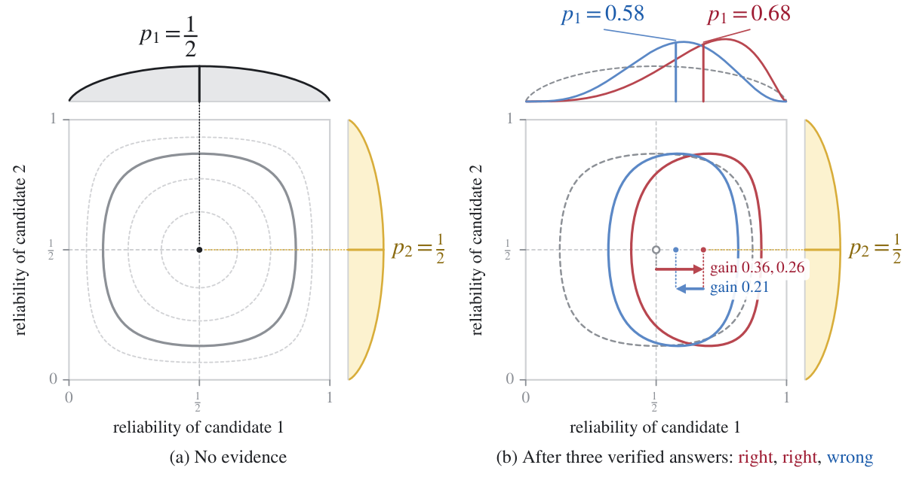

<div align="center">
<h2>BaRe-Mem: Bayesian Reliability Memory for Robust and Adaptive Agent Consultation</h2>
</div>
<div align="center">

[Peilin Feng](https://peilin-ff.github.io/)<sup>1</sup>,
Zhengyang Huang<sup>2</sup>,
[Soujanya Poria](https://soujanyaporia.github.io/)<sup>1,†</sup>

<sup>1</sup>[DeCLaRe Lab](https://declare-lab.github.io/), Nanyang Technological University &nbsp;&nbsp; <sup>2</sup>Peking University

<sup>†</sup>Corresponding author

[](https://arxiv.org/abs/2609.35551)
[](https://huggingface.co/papers/2609.35551)
[](https://huggingface.co/spaces/Sssunset/BaRe-Mem)
[](https://huggingface.co/datasets/Sssunset/BaRe-Mem-Data)
[](https://huggingface.co/collections/Sssunset/bare-mem-6abb44ac19b8e5e9deacd989)

</div>

This repository contains the official implementation and evaluation code of **BaRe-Mem: Bayesian Reliability Memory
for Robust and Adaptive Agent Consultation**. It holds no data, outputs or logs: the datasets are downloaded from
Hugging Face, and every result is regenerated by the pipeline.

## 📰 News
- **[2026.09.29]**: 🌐 The [project page](https://huggingface.co/spaces/Sssunset/BaRe-Mem) is online.
- **[2026.09.29]**: 🤗 We release the BaRe-Mem datasets on [Hugging Face](https://huggingface.co/datasets/Sssunset/BaRe-Mem-Data).
- **[2026.09.28]**: 🔥 We release **BaRe-Mem: Bayesian Reliability Memory for Robust and Adaptive Agent Consultation**. Check out the [paper](https://arxiv.org/abs/2609.35551).

## BaRe-Mem Overview

<div align="center">

</div>

<p align="center"><em>The reliability memory update. (a) Without verified evidence, all advisors are assigned equal
reliability. (b) Updating only candidate 1 with two correct outcomes shifts its estimated reliability to the red
posterior, while a subsequent incorrect outcome yields the blue posterior.</em></p>

In multi-agent systems, reliable consultation is challenging because advisor capabilities vary across tasks, and
misleading information can make consultation worse than autonomous reasoning. We introduce **BaRe-Mem**, an online
Bayesian reliability memory for multi-agent consultation. It estimates advisor reliability based on the central
model's internal belief representations and updates these estimates from verified interaction history. These estimates
modulate the influence of advisor responses and guide the choice between consultation and autonomous reasoning.

Across nine benchmarks and six central models, BaRe-Mem is more robust to misleading advisor information than debate
and majority voting. On the more challenging tasks, it remains above autonomous reasoning across all tested misleading
levels. We further extend the BaRe-Mem mechanism to worker allocation in agent teams: on MuSiQue, BaRe-Mem improves
task completion over routing by historical success counts and identifies capable workers earlier.

How the method maps onto the code (the memory, the attention tilt, the consultation decision and the feedback
protocol) is described in [docs/pipeline.md](docs/pipeline.md#the-method-in-code).

## Environment Setup

```bash
conda create -n bare-mem python=3.12
conda activate bare-mem
pip install -r requirements_qwen3.txt
pytest tests/unit          # optional, CPU only: the record, the rules and the configs
```

vLLM must be exactly 0.8.5: the attention tilt patches its attention kernels. `run.sh` activates the `bare-mem`
environment (set `BAREMEM_ENV` to use another name).

## 📝 Model Preparation

Download the six central models:

```bash
cd BaRe-Mem
mkdir -p models

hf download Qwen/Qwen3-4B --local-dir models/Qwen3-4B
hf download Qwen/Qwen3-8B --local-dir models/Qwen3-8B
hf download Qwen/Qwen3-14B --local-dir models/Qwen3-14B
hf download Qwen/Qwen2.5-7B-Instruct --local-dir models/Qwen2.5-7B-Instruct
hf download mistralai/Ministral-8B-Instruct-2410 --local-dir models/Ministral-8B-Instruct-2410
hf download microsoft/phi-4 --local-dir models/phi-4
```

The released datasets already contain the answers of the six advisors (`peer_0` … `peer_5` in the code). The advisor
models are needed only to generate new answers: the workers' reports in the agent-team experiment, or a new misleading
regime. Llama-3.1-8B-Instruct is also run as a central model by the `*_families` and `agent_team_llama31` experiments.

```bash
hf download google/gemma-3-4b-it --local-dir models/gemma-3-4b-it
hf download microsoft/Phi-4-mini-instruct --local-dir models/Phi-4-mini-instruct
hf download Qwen/Qwen2.5-Coder-7B-Instruct --local-dir models/Qwen2.5-Coder-7B-Instruct
hf download meta-llama/Llama-3.1-8B-Instruct --local-dir models/Meta-Llama-3.1-8B-Instruct
hf download deepseek-ai/DeepSeek-Coder-V2-Lite-Instruct --local-dir models/DeepSeek-Coder-V2-Lite-Instruct
hf download deepseek-ai/DeepSeek-R1-Distill-Qwen-7B --local-dir models/DeepSeek-R1-Distill-Qwen-7B
```

Llama-3.1-8B-Instruct and gemma-3-4b-it are gated: accept their licences on Hugging Face and run `hf auth login`
first. The resulting directory layout is:

```text
models/
├── Qwen3-4B/
├── Qwen3-8B/
├── Qwen3-14B/
├── Qwen2.5-7B-Instruct/
├── Ministral-8B-Instruct-2410/
├── phi-4/
├── gemma-3-4b-it/
├── Phi-4-mini-instruct/
├── Qwen2.5-Coder-7B-Instruct/
├── Meta-Llama-3.1-8B-Instruct/
├── DeepSeek-Coder-V2-Lite-Instruct/
└── DeepSeek-R1-Distill-Qwen-7B/
```

The configs load these paths directly (`configs/models/`, under `paths.models_root` in `configs/base.yaml`). Set
`gpus` in `configs/base.yaml` to the GPUs the runner may use.

## 📦 Data Preparation

Download the evaluation datasets into `data/`:

```bash
python datasets/download.py
```

The files come from [Sssunset/BaRe-Mem-Data](https://huggingface.co/datasets/Sssunset/BaRe-Mem-Data); each is checked
against its sha256 in `datasets/manifest.json` before it is unpacked. `--only <dataset> ...` downloads a subset.

### Dataset Card

Every event holds a question, its gold answer, the six advisors' answers and their verified correctness.

| Dataset | Events | Description |
| --- | ---: | --- |
| `capability_supported` | 4,319 | Capability-supported stream: GSM8K test, SQuAD dev and APPS test |
| `capability_challenging` | 17,403 | Capability-challenging stream: PIQA, MMLU, OpenBookQA, SciQ, BBH and SuperGLUE |
| `<stream>_misleading_p000` … `_p100` | 4,319 / 17,403 | The stream with 0, 25, 50, 75 or 100% of every advisor's answers misleading |
| `<stream>_misleading` | 25,914 / 104,418 | Answer pools: every advisor's verified misleading answer to every event |

After downloading, the files read by the configs are:

```text
data/
  capability_supported/test.jsonl
  capability_challenging/test.jsonl
  capability_{supported,challenging}_misleading_p{000,025,050,075,100}/test.jsonl
  capability_{supported,challenging}_misleading/<peer>/shard0of1.jsonl
```

The agent-team stream is built by the pipeline from MuSiQue, whose dev file is fetched from Hugging Face
(`dgslibisey/MuSiQue`) when missing.

## 🚀 Evaluation

Every experiment is one YAML file in `configs/experiments/` and runs with one command. Runs are resumable: running a
command again skips the work already finished.

```bash
bash run.sh configs/experiments/main.yaml --dry-run    # the jobs, and which are already done
bash run.sh configs/experiments/main.yaml --smoke      # 48 events through every step, into outputs/smoke/
bash run.sh configs/experiments/main.yaml              # the whole experiment
```

Each experiment writes its result table to `outputs/tables/<experiment>.md`, and every model, dataset and condition
its answers and metrics to `outputs/eval/<model>/<dataset>/<condition>/` (`generations.jsonl`, `eval_metrics.json`).
Code answers are graded by executing them in a subprocess with limits, not a sandbox: use a disposable machine.
`docs/experiments/` has a guide for each experiment.

### Advisors + memory

Qwen3-4B on the two streams under No consultation, Question + Peers and Advisors + memory, plus `swap`, a control that
permutes the record's ranking:

```bash
bash run.sh configs/experiments/main.yaml
```

### Misleading advisors

The same three conditions when 0, 25, 50, 75 or 100% of the advisors' answers are misleading:

```bash
bash run.sh configs/experiments/misleading.yaml
```

### BaRe-Mem

Per question, BaRe-Mem takes Advisors + memory or No consultation, as the reading line decides; Qwen3-4B and Qwen3-8B
at every misleading ratio:

```bash
bash run.sh configs/experiments/combination.yaml
```

### Multi-agent baselines

Majority vote (advisors), Majority vote (advisors + own), Debate (1 and 2 rounds) and Debate + vote on the same
datasets. It reads the results of `combination`, so run that first:

```bash
bash run.sh configs/experiments/baselines.yaml
```

### Other central models

The experiments above for Qwen3-8B, Qwen3-14B, Qwen2.5-7B, Llama-3.1-8B, Ministral-8B and phi-4. Each command runs
every model in its config; `--set central=[qwen25]` runs one of them:

```bash
bash run.sh configs/experiments/families.yaml
bash run.sh configs/experiments/misleading_families.yaml
bash run.sh configs/experiments/combination_families.yaml
bash run.sh configs/experiments/baselines_families.yaml
```

### Agent team

A lead-worker team on MuSiQue: the lead gives each sub-task to one source in the order its record gives, with no check,
the lead's own check or the dataset's check before the commit. The workers are the six advisors; the other leads reuse
their reports:

```bash
bash run.sh configs/experiments/agent_team.yaml                   # lead: Qwen3-4B
for lead in qwen3_8b qwen3_14b qwen25 llama31 ministral phi4; do
  bash run.sh configs/experiments/agent_team_$lead.yaml
done
```

### Sparse feedback

How much verified feedback the record needs, for Qwen3-4B and Qwen3-8B. It reads the results of `combination`:

```bash
MODELS_ROOT=models bash analysis/sparse_feedback.sh
PYTHONPATH=. python analysis/bare_analysis.py > bare_analysis.json    # summary of combination and sparse feedback
```

### Extending

Datasets, models, peers and task types are registered one YAML file each, and experiments refer to them by name.
[docs/pipeline.md](docs/pipeline.md) describes the stages, the registries, the experiment options and the output layout.

## ❤️ Citation

If you find our work useful, please kindly cite:

```bibtex
@article{feng2026bare,
  title={BaRe-Mem: Bayesian Reliability Memory for Robust and Adaptive Agent Consultation},
  author={Feng, Peilin and Huang, Zhengyang and Poria, Soujanya},
  journal={arXiv preprint arXiv:2609.35551},
  year={2026}
}
```
